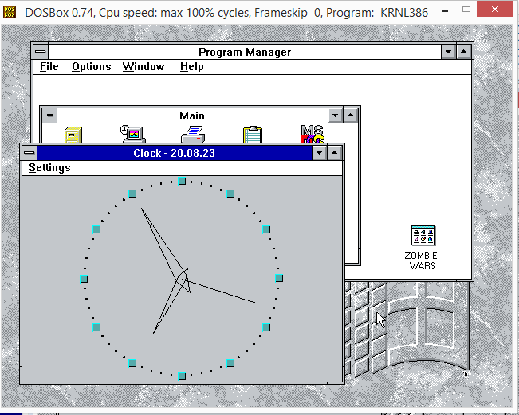
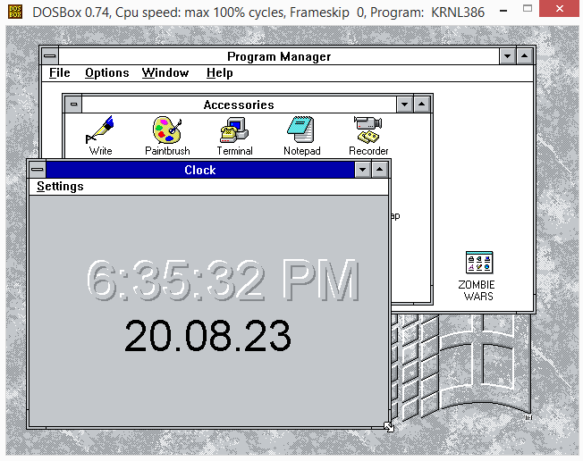

# osFree Clock

A clone of the classic Windows 3.x Clock application, extended and ported
to 16‑bit (Windows 3.x) from Wine Clock. This is part of the
[osFree Win16 Personality](https://github.com/osfree-project/WIN16) project —
an open‑source implementation of the 16‑bit Windows environment.

## 📖 About

Clock displays the current date and time using both an **analog** and a
**digital** representation. It is a component of the **osFree Janus** project
to create an open‑source clone of Windows 3.0. The application is based on
the Wine Clock code, adapted for the 16‑bit Windows API and extended with
additional features.

The project continues the original idea by Marcel Baur (1998) and is currently
maintained by the osFree team.

## ✨ Features

*   **Dual display mode** – Switch between analog and digital views via the
    *Settings* menu or by double‑clicking the clock face.
*   **Customisable face** – Show or hide the seconds hand, the date, and the
    window title bar.
*   **Always‑on‑top** – Keep the clock visible above other windows.
*   **Remembered settings** – Window position, size, and display options are
    saved between sessions.
*   **Lightweight** – Minimal resource usage, just like the original Windows 3.x
    clock.
*   **Localisation ready** – Resource file (`clock.rc`) can be translated; the
    current version includes English strings.
*   **Debug support** – When a debug version of the system is present, extra
    diagnostic information is shown.

## 🧩 Project Structure

| File | Description |
| :--- | :--- |
| `main.c` | Main application source code |
| `main.h` | Header file with common definitions |
| `winclock.c` | Core clock implementation (drawing, time handling) |
| `winclock.h` | Header file for clock‑specific functions |
| `clock.rc` | Resource file (menus, dialogs, strings) |
| `clock_res.h` | Resource identifiers |
| `colors.h` | Colour definitions |
| `makefile` | Build file for Open Watcom Make |
| `_wcc.cmd` / `_wcc.sh` | Auxiliary build scripts |
| `clock.docx` | Documentation file |

## 🤝 Contributing

We welcome your contributions! Please keep the following in mind:

*   **Bug reports** – Create issues in the
    [Issues](https://github.com/osfree-project/clock/issues) section.
*   **Pull requests** – Send your improvements and fixes.
*   **Documentation and localisation** – Help translating the interface into
    other languages is highly valuable.

## 📜 License

Distributed under the **GNU Lesser General Public License v2.1 (LGPL‑2.1)**.
See [LICENSE](LICENSE) for more details.

## 🔗 Related Projects

*   [osFree Win16 Personality (WIN16)](https://github.com/osfree-project/WIN16) –
    the main project to create an open‑source clone of Windows 3.x
*   [osFree Project](https://github.com/osfree-project) – the parent project for
    an open‑source OS/2 clone
*   [WinVer](https://github.com/osfree-project/winver) – a clone of the Windows
    “About” dialog
*   [Notepad](https://github.com/osfree-project/notepad) – a clone of Notepad
*   [Taskman](https://github.com/osfree-project/taskman) – a clone of Task Manager

## 👤 Copyright

*   Copyright (C) 1998 Marcel Baur
*   Copyright (C) 2002 Sylvain Petreolle
*   Copyright (C) osFree project

---

*Last updated: May 25, 2026*
